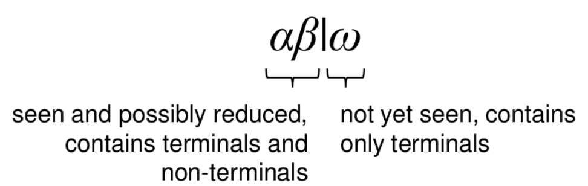

## 컴파일 과정

(소스코드) - 전처리기 - 컴파일러 - (어셈블리어 코드) - 어셈블러 -(object파일) - 링커 - (실행가능 프로그램)

1. 전처리기
   #include  
   #define
2. 컴파일러
   전처리된 소스코드를 어셈블리어로 번역한다.
3. 어셈블러
   기계어로 된 object파일을 생성한다.(여기까지 보통 컴파일이라고 함)
4. 링커  
   여러 개의 object파일,

\*`심볼 테이블` 식별자(함수,변수,상수,데이터타입)와 관련된 정보를 저장.

- 컴파일러의 거의 모든 실행 단계와 상호작용.
- 빈번히 접근하므로, 삽입,제거,접근 등은 상수 시간에 수행될 만큼 효율적이어야 함.

# Lexical Analysis - scanner

`토큰`을 생성한다.

# Syntax Analysis - parser

> input에 대해 production rule을 적용시켜 CFG의 grammar에 충족하는지, input이 어떤 속성을 가지는지를 분석하는 과정. 최종적으로 `parse tree`를 생성한다.

지속적으로 nonterminal symbol이 있는지를 확인해 production 과정을 수행하고,
terminal이 남을 때까지 반복한다.
이 때 어떤 production rule

## CFG(context free grammer)

:Terminal과 Nonterminal의 상관관계를 표현한 문법
(사진)

## CFG의 필요성

RE는 요소의 갯수를 파악할 수 없다. 따라서 무한정으로 긴 RE도 있을 수 있고,
또 다른 문제는 괄호의 경우 열린괄호와 닫힌괄호의 갯수가 같아야 하는데 RE로는 이를 표현하는 것이 어렵다. 따라서 RE를 포괄하는 CFG를 통해 define한다.

(`context free` 어떤 nonterminal이 들어와도 해당 symbol에 대한 production rule 성립)

## CFG의 4요소

- terminal symbols -> token,입실론
- non-terminal symbols
- start symbol S
- production rules -> LHS를 RHS로 derivation하는 규칙들

- Start Symbol, 좌측항은 Nonterminal로 시작
- Nonterminal로부터 파생될 수 있는 Symbol은 Terminal, Nonterminal, Empty String.
  G = {Terminal, Nonterminal, Production, Start Symbol}
  Nonterminal이 있으면 없을때까지 production 적용.

`derivation` 사전에 정의된 grammar로 replacement
ex)E에 대한 production set이 E->E+E|E-E|-E|(E)|id 일 때 E->-(id)라는 새로운 grammar가 성립하는가?
: E->-E->-(E)->-(id) 이므로 성립

`CFG Ambiguity` derivation을 어떤 요소부터 수행하느냐에 따라 결과가 달라짐 ->규칙 필요
규칙1 `leftmost derivation` left nonterminal을 먼저 terminal로 바꿈
규칙2 `rightmost derivation` right nonterminal을 먼저 terminal로 바꿈
잘못된 규칙을 적용한 예 : `Dangling Else` -> 몇몇 케이스 정의, 치명적이지 않은 ambiguity는 허용

`left recursion` 왼쪽에서부터 자기자신이 replace됨 -> top down에서 무한루프의 문제 발생
-> grammar rewrite
`right recursion`
`left factoring` left recursion은 CFG가 leftmost derivation을 따르므로 문법에 맞는지 알 수 없다.
-> right recursion으로 바꾸는 과정.

`AST(Abstract Syntax Tree)` parse tree 중 derivation 과정을 제외한 필수적 정보만 담음. (parse tree와 동일한 정보)

2-1. top-down(하향식) parsing (=recursive descent parsing)

> tree의 맨 위에서부터 parse tree를 그리면서 결과를 찾는 방법. compiler입장에서는 왼쪽부터 input string을 검색하게 된다.(left recursive)

이때,

- `되추적 파서(backtracking)`

  - input이 어떤 terminal들로 구성되어있는지 모르므로, production rule을 적용하며 input과 하나씩 비교한다.
  - 이 때 잘못된 production rule을 적용하여 fail이 return되면, 백트래킹으로 돌아가서 다시 수행한다.

- `예측 파서(predictive parser)`
  : 위의 백트래킹 방법은 시간이 많이 소요된다. 따라서 1개 이상의 lookahead tokens으로 다음 토큰을 보는 예측 파서가 필요하다.

  - `LL(1) 파싱`
    : left에서 right, leftmost derivation, 1만큼 lookahead

    1. token에 대한 transition을 First()와 Follow()로 나눠서 찾기
       `FIRST(A)` A의 set 중 첫번째 terminal을 찾음.

       - X가 terminal이면 FIRST(X) = {X}
       - X-> ε 이면 ε을 FIRST(X)에 추가

       `FOLLOW(A)` A 바로 다음에 나올 수 있는 terminal 들의 집합
       FOLLOW(S)에는 $가 항상 포함됨.
            (`$` 파일의 끝을 나타냄)

       -> 심볼들의 first와 follow의 관계를 통해 parse tree를 더 쉽게 찾는다.

    2. `parsing table` 만들기
       표의 row는 nonterminal, column은 terminal(input symbol)

       각 transition에 대한 first(nonterminal) 을 표에 채운다.(없는 경우 follow를 채운다.)

    문제점 : left recursion,
    lookahead 하나만으로 하향식 파싱 불가한 경우 lookahead를 늘려야 하는데, 이는 컴파일러 성능에 영향,
    absolute한 path를 찾는데 오래 걸리고, 메모리 비효율적.

2-2. bottum-up(상향식) parsing (대부분의 방식)
: leaf에서 root를 찾아가는 방법. righmost derivation

left recursion으로 인한 무한루프에 빠지지 않음. 다음에 무엇이 나올지 고민 필요 X
`handle` reduce할 string

`shift reduce parsing(LR parsing)`

parsing을 한 것과 안 한 것을 구분하는 indicator |
왼쪽은 이미 볼 수 있고, 기존에 주어진 grammar로 reduction 수행
오른쪽은 아직 parser가 string을 인식 못한 상태 1.`shift` reduce 불가능한 경우 indicator가 왼쪽에서 오른쪽으로 shift -> stack에 push
2.reduce 가능하면 pop하고 replace한 결과 push

`reduce-reduce conflict` 어떤 것을 reduce해야 할지 모르는 경우((ex)A->a, B->a)
`shift-reduce conflict` shift를 해야 할지 reduce를 해야 할지의 문제
해결책 : `LALR(LookAhead LR) Parser`

`Heuristic` 뒤쪽 인식되지 않은 string을 배제하더라도 root node 찾음.

참고 : https://talkingaboutme.tistory.com/entry/Study-Context-Free-Grammar-CFG
